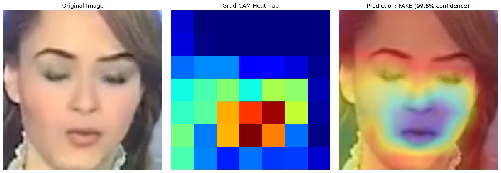
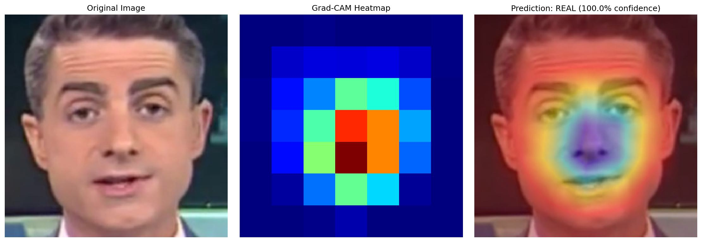
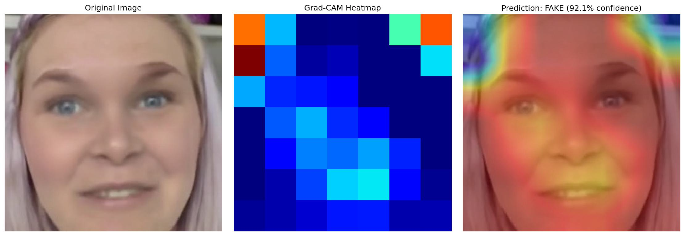

# Deepfake Detection with Explainable AI

A deep learning system for detecting AI-generated deepfake videos using transfer learning and Grad-CAM explainability.



##  Results

- **Test Accuracy**: 90.83%
- **Model**: EfficientNet-B0 with transfer learning
- **Dataset**: FaceForensics++ (400+ videos)
- **Key Innovation**: Video-level train/test splitting to prevent data leakage

##  Features

### 1. Robust Detection
- Binary classification (Real vs Fake faces)
- Transfer learning from ImageNet for efficient training
- Proper video-level data splitting prevents identity memorization

### 2. Explainable AI (Grad-CAM)
- Visualizes which facial regions indicate manipulation
- Highlights artifacts like blurred edges and lighting inconsistencies
- Makes the "black box" model interpretable

### 3. Production-Ready Pipeline
- Automated face extraction from videos
- Batch processing for multiple videos
- Visualization generation for model interpretation

##  Sample Results

### Real Face Detection
The model correctly identifies real faces with diffuse attention patterns:



### Fake Face Detection
The model highlights manipulation artifacts (red areas show suspicious regions):



Notice how the model focuses on:
- Blurred jawline boundaries (face swap edges)
- Inconsistent textures around face perimeter
- Lighting mismatches

##  Quick Start

### Installation
```bash
# Clone repository
git clone https://github.com/YOUR_USERNAME/deepfake-detection.git
cd deepfake-detection

# Install dependencies
pip install -r requirements.txt

# Download pre-trained model (if not using Git LFS)
# [Add Google Drive link if needed]
```

### Usage

#### 1. Extract Faces from Videos
```bash
python src/extract_faces.py
```

#### 2. Train Model
```bash
python src/train_model_fixed.py
```

#### 3. Generate Grad-CAM Visualizations
```bash
python src/gradcam_visualization.py
```

##  Architecture
```
Input Image (224×224)
    ↓
EfficientNet-B0 Backbone
  - Layers 1-5: Frozen (pre-trained features)
  - Layers 6+: Fine-tuned for deepfakes
    ↓
Global Average Pooling
    ↓
Fully Connected Layer (1280 → 2)
    ↓
Softmax → [Real, Fake]
```

##  Project Structure
```
deepfake-detection/
├── src/
│   ├── extract_faces.py           # Extract faces from videos
│   ├── train_model_fixed.py       # Train detection model
│   └── gradcam_visualization.py   # Generate explainability heatmaps
├── models/
│   └── best_model_fixed.pth       # Trained model weights
├── sample_images/
│   ├── real/                      # Sample real faces
│   └── fake/                      # Sample fake faces
├── results/
│   └── sample_visualizations/     # Example Grad-CAM outputs
├── requirements.txt
└── README.md
```

##  How It Works

### Detection Pipeline

1. **Face Extraction**: OpenCV detects and crops faces from video frames
2. **Preprocessing**: Resize to 224×224, normalize using ImageNet statistics
3. **Feature Extraction**: EfficientNet-B0 extracts 1280-dimensional features
4. **Classification**: Fully connected layer outputs Real/Fake probability
5. **Explainability**: Grad-CAM highlights discriminative regions

### Key Technical Decisions

#### Video-Level Splitting
Initial naive image-level splitting achieved 98% accuracy but was **data leakage**:
- Training set: `person_A_frame_1.jpg`
- Test set: `person_A_frame_2.jpg`
- Model memorized identities, not deepfake patterns 

Fixed with video-level splitting:
- Training videos: Persons A, B, C
- Test videos: Persons X, Y, Z (never seen before)
- Model learns actual manipulation artifacts 
- Realistic accuracy: 90.83%

#### Transfer Learning
Started with EfficientNet-B0 pre-trained on ImageNet:
- Already knows edge detection, texture analysis
- Freeze early layers (basic features)
- Fine-tune later layers (deepfake-specific patterns)
- Requires only 400 videos vs. millions from scratch

##  Performance

| Metric | Value |
|--------|-------|
| Test Accuracy | 90.83% |
| Validation Accuracy | 95.00% |
| Training Samples | ~2,800 faces |
| Test Samples | ~600 faces |
| Training Time | ~45 min (CPU) |


##  Dataset

[FaceForensics++](https://github.com/ondyari/FaceForensics) - Benchmark deepfake detection dataset
- **Real videos**: YouTube videos (pristine)
- **Fake videos**: Deepfakes, Face2Face, FaceSwap manipulations
- **Compression**: c23 (medium quality)

##  Key Learnings

1. **Data leakage is subtle**: Image-level splitting gave false 98% accuracy
2. **Explainability matters**: Grad-CAM proved model learned real artifacts, not shortcuts
3. **Transfer learning is powerful**: Achieved 90%+ with only 400 videos
4. **Edge artifacts are key**: Model focuses on face boundaries where blending occurs

##  Future Improvements

- [ ] Ensemble multiple architectures (EfficientNet, Xception, ResNet)
- [ ] Add temporal analysis (multi-frame sequences)
- [ ] Incorporate frequency domain features (FFT analysis)
- [ ] Train on additional manipulation methods (NeuralTextures, FaceShifter)
- [ ] Deploy as web API for real-time detection

##  Citation

If you use this code, please cite:
```bibtex
@software{deepfake_detection_2025,
  author = {Your Name},
  title = {Deepfake Detection with Explainable AI},
  year = {2025},
  url = {https://github.com/YOUR_USERNAME/deepfake-detection}
}
```

##  License

MIT License - see LICENSE file for details

##  Acknowledgments

- [FaceForensics++](https://github.com/ondyari/FaceForensics) for the dataset
- [PyTorch](https://pytorch.org/) for the deep learning framework
- [Grad-CAM](https://arxiv.org/abs/1610.02391) paper for explainability method

---
